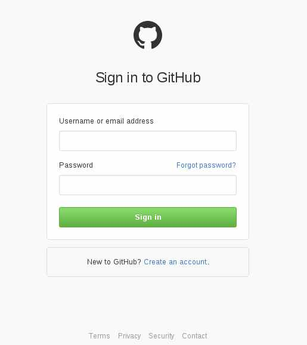
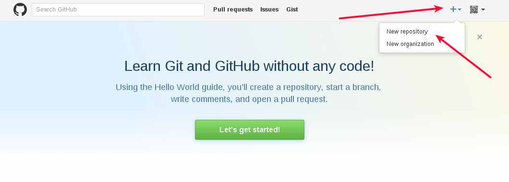
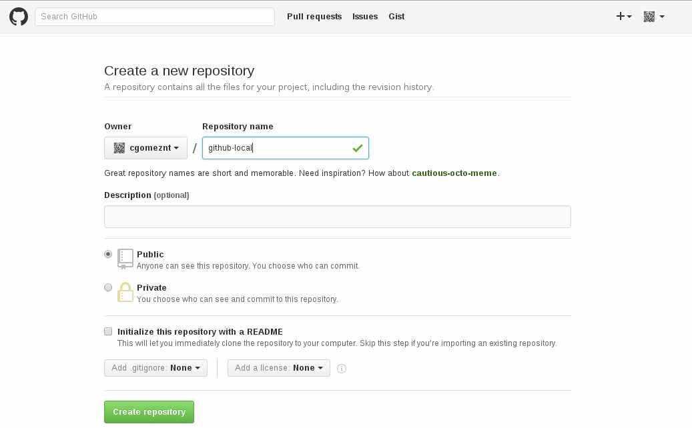
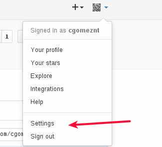
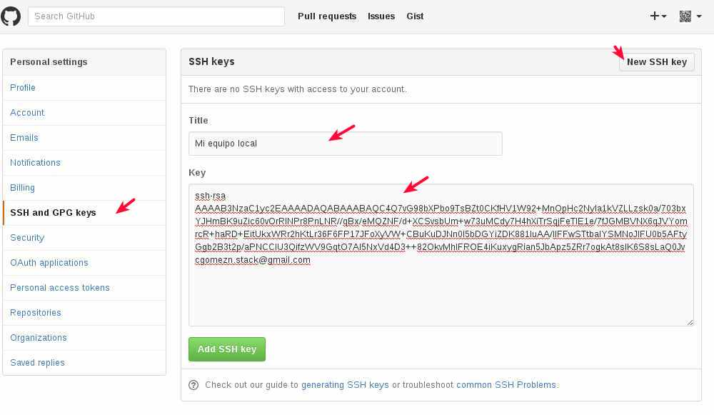
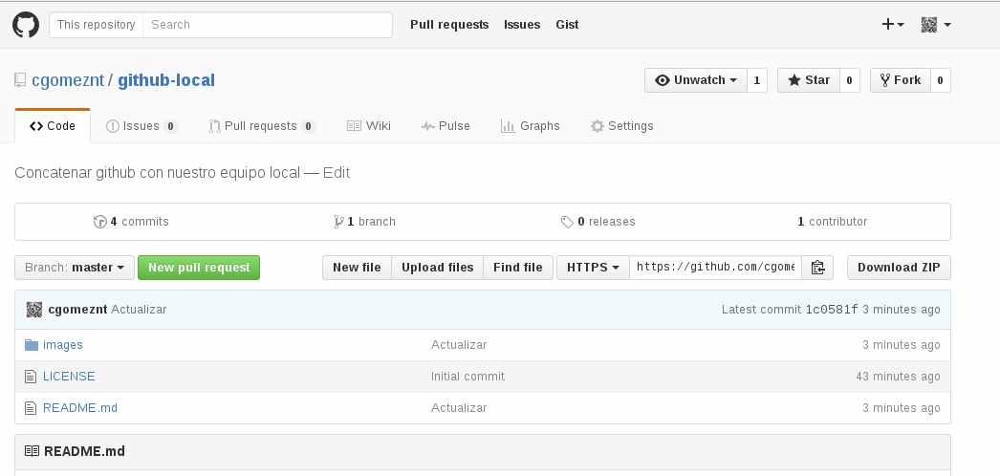

## Concatenar github con nuestro equipo local 

Vamos a configurar nuestro equipo local para que podamos tener sincronizado nuestros repositorios contra github.


##### Instalamos git
```
# apt-get install git
```

##### Configuramos las variables de nombre y e-mail para git.
```
$ git config --global user.name "Carlos G. G." 
$ git config --global user.email "cgomez.stack@gmail.com"
```

##### Preparamos la concatenación de nuestro equipo local con git.
Creamos un directorio de trabajo
```
$ mkdir github-local
```
Creamos una llave para copiarla en https://github.com para que exista la relación confianza con nuestro equipo local.
```
$ ssh-keygen -t rsa -C "cgomezn.stack@gmail.com"


Generating public/private rsa key pair.
Enter file in which to save the key (/home/cgome1/.ssh/id_rsa): 
Enter passphrase (empty for no passphrase): 
Enter same passphrase again: 
Your identification has been saved in /home/cgome1/.ssh/id_rsa.
Your public key has been saved in /home/cgome1/.ssh/id_rsa.pub.
The key fingerprint is:
ae:86:f4:df:87:4f:6d:ea:ee:7c:d6:e0:7d:ca:5a:4c cgomezn.stack@gmail.com
The key's randomart image is:
+---[RSA 2048]----+
|                 |
|                 |
|                 |
|                 |
|        S     E  |
|    .  .     +.  |
|   . o  .  ...=+ |
|    . o. ..o.=+ +|
|     .... .*O+o..|
+-----------------+
```

Luego nos copiamos el contenido generado de la llave
```
$ cat /home/cgome1/.ssh/id_rsa.pub

ssh-rsa AAAAB3NzaC1yc2EAAAADAQABAAABAQC4Q7vG98bXPbo9TsBZt0CKfHV1W9
2+MnOpHc2NyIa1kVZLLzsk0a/703bxYJHmBK9uZic60vOrRINPr8PnLNR//qBx/eMQZNF/d+XCSvsbU
m+w73uMCdy7H4hXiTrSqjFeTlE1e/7fJGMBVNX6qJVYomrcR+haRD+EitUkxWRr2hKtLr36F6FP17JFoXyVW+CBuKuDJNn0I5bDGYiZDK881IuAA
/lIFFwSTtbalYSMNoJlFU0b5AFtyGgb2B3t2p/aPNCCIU3QifzWV9GqtO7Al5NxVd4D3
++82OkvMhlFROE4iKuxygRian5JbApz5ZRr7ogkAt8sIK6S8sLaQ0Jv cgomezn.stack@gmail.com

```

En https://github.com nos registramos y creamos un repositorio.







Esta es la ruta de nuestro repositorio


Nos vamos a  https://github.com y en la parte superior buscamos el menu de **Setting**, seleccionamos **SSH and GPG keys** y al lado pulsamos **New SSH key**, en **title** colocamos un titulo que permita identificar cual es el equipo y en **Key** colocamos el contenido copiado anteriormente con el comando "cat /home/cgome1/.ssh/id_rsa.pub"






Ahora en nuestro directorio de trabajo y en donde estará nuestro repositorio concatenado con el que esta publicado den github.
```
$ git init
```

Creamos un archivo llamdo README.md (https://es.wikipedia.org/wiki/Markdown)
```
$ vi README.md
```

Le indicamos al git que lo agregue
```
$ git add README.md
```

Hacemos el comentario sobre los archivos agregados.
```
$ git commit -m "Actualizar"
```

Debemos tener la ruta de nuestro repositorio en https://github:


Procedemos a indicarle a git cual sera el origen del repositorio remoto 
```
git remote add origin https://github.com/cgomeznt/github-local.git
```
Si ya tenemos alguna información en el repositorio de github hacemos primero, para hacer el merge.
```
git pull https://github.com/cgomeznt/github-local.git
```

Ahora subimos los cambios de nuestro local hacia el repositorio en github, coloca tu usuario y clave de github.
```
$ git push origin master
```

Felicitaciones ya tiene github concatenado con su equipo en local ...!!!




Luego para tener actualizado github con su repositorio despues que agregue, modifique o eliminie archivos, seria (esto es muy basico, hay más)
```
$ git add *
$ git commit -m "Actualizar"
$ git push origin master

```

